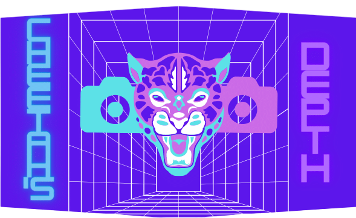

# StereoDepthEstimation




---

## Description
StereoDepthEstimation contiene l'implementazione in c++ del calcolo della profondità partendo da una coppia di immagini stereo, il progetto è composto da una versione sequenziale e da una versione parallela. ComputerVision è diviso nelle seguenti parti:
- ***PixelMatching***: contiene l'implementazione dell'algoritmo per il calcolo della matrice delle profondità.
- ***stereo_calibration***: contiene l'implementazione della calibrazione di un sistema stereo.
- ***calibration***: contiene l'implementazione della calibrazione di un sistema a singola camera.
- ***point_cloud***: contiene l'implementazione per passare dalla matrice delle profondità al modello 3D rappresentato tramite una nuvola di punti. 
- ***disparity_map***: rappresenta l'immagine tramite una colormap per evidenzare le zone di maggior profondità.
- ***zed_benchmark***: progetto utilizzato come ground truth in fase di benchmark 

## Stages
1. Come prima fase è prevista una calibrazione del sistema implementata in **stereo_calibration**.
2. Successivamente si passa al calcolo della matrice di profondità a partire da una coppia di immagini stereo, acquisite tramite una camera stereo calibrata precedentemente, l'implementazione si trova in **PixelMatching**.
3. Tramite la matrice di profondità e le varie posizioni dei pixel nelle due immagini si crea un modello 3D rappresentato tramite una nuvola di punti (PCL), l'implementazione si può trovare in **point_cloud**.


## Dipendencies

##### CMAKE MAKE DOXYGEN GCC
The project require [CMake](https://cmake.org/), [Make](https://www.gnu.org/software/make/), [doxygen](https://www.doxygen.nl/), [gcc](https://gcc.gnu.org/). On Ubuntu:
``` bash
sudo apt update && sudo apt upgrade -y
sudo apt install make
sudo apt install build-essential
sudo apt install cmake
sudo apt-get install doxygen
```

##### PCL
point_cloud project require [PCL library](https://pointclouds.org/). On Ubuntu:
``` bash
sudo apt-get update && sudo apt upgrade -y
sudo apt-get install git build-essential linux-libc-dev
sudo apt-get install cmake cmake-gui
sudo apt-get install libusb-1.0-0-dev libusb-dev libudev-dev
sudo apt-get install mpi-default-dev openmpi-bin openmpi-common 
sudo apt-get install libflann1.9 libflann-dev
sudo apt-get install libeigen3-dev
sudo apt-get install libboost-all-dev
sudo apt install libpcl-dev
sudo apt-get install libqhull* libgtest-dev
sudo apt-get install pkg-config
sudo apt-get install libxmu-dev libxi-dev
sudo apt-get install mono-complete
```
or  [github repository](https://github.com/PointCloudLibrary/pcl) 

---

##### OPENCV
calibration and streo_calibration projects require [OpenCV library](https://opencv.org/). On Ubuntu:
``` bash
sudo apt update && sudo apt upgrade -y
sudo apt install libopencv-dev python3-opencv
sudo apt-get install libavcodec-dev libavformat-dev libswscale-dev
sudo apt-get install libgstreamer-plugins-base1.0-dev libgstreamer1.0-dev
sudo apt-get install libgtk-3-dev
sudo apt-get install libpng-dev
sudo apt-get install libjpeg-dev
sudo apt-get install libopenexr-dev
sudo apt-get install libtiff-dev
sudo apt-get install libwebp-dev
```
or [github repository](https://github.com/opencv/opencv)

---

##### ZED SDK
zed_benchmark require [zed sdk](https://www.stereolabs.com/developers/release/), for the installation of sdk on linux systems → [zed sdk installation](https://www.stereolabs.com/docs/installation/linux/)

## Integration

Build Platform           | Status
------------------------ | ------------------------------------------------------------------------------------------------- |
Ubuntu                   |  | 
Windows                  |  |
macOS                    | |
